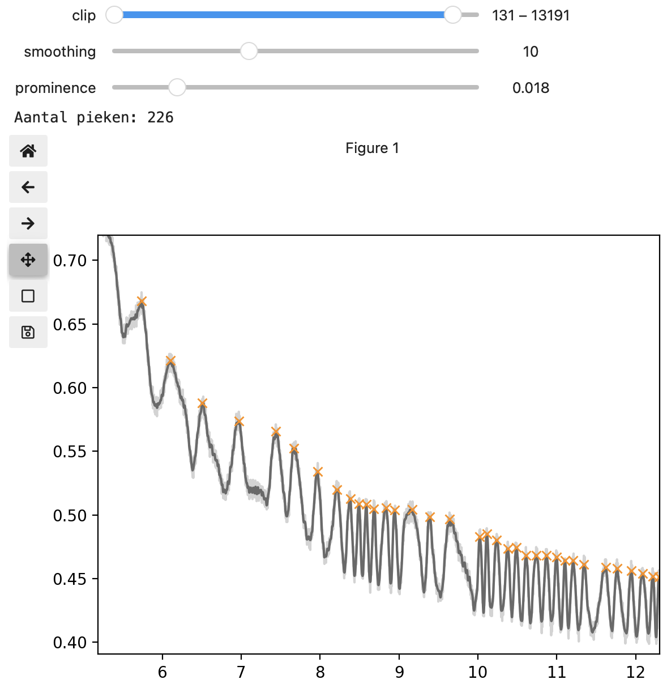

# Peak finder

You can use this notebook to find peaks in your data.

## Getting everything set up

### uv

If you downloaded or cloned this repository, simply run:

```shell
uv sync
```

To set up your virtual environment. You can also add the dependencies listed in `pyproject.toml` to an existing project's environment.

Run the notebook from Visual Studio Code by selecting the peak-finder .venv as the environment for the kernel or run Jupyter Lab with

```shell
uv run jupyter-lab peak-finder.ipynb
```

### uvx

If you just have a copy of the notebook and want to run Jupyter Lab with the required dependencies but without installing anything run

```shell
uvx --from jupyterlab --with ipympl,matplotlib,numpy,pandas,scipy jupyter-lab peak-finder.ipynb
```

### Conda (Anaconda or Miniconda)

To create a conda environment with Jupyter Lab and all dependencies, run:

```shell
$ conda env create -f environment.yml
```

Run Jupyter Lab with

```shell
$ conda activate peak-finder
$ jupyter lab peak-finder.ipynb
```

and load the notebook, or run the notebook from e.g. Visual Studio Code while selecting the peak-finder conda environment.

## Running the notebook

At the bottom of the notebook you will find this line:

```python
find_peaks("example-datafile.csv")
```

Change `example-datafile.csv` to point at your data file or just run the notebook with the example data. You should see something like this:



You can zoom into parts of your dataset and tweak the settings until you're satisfied with the detected peaks.
