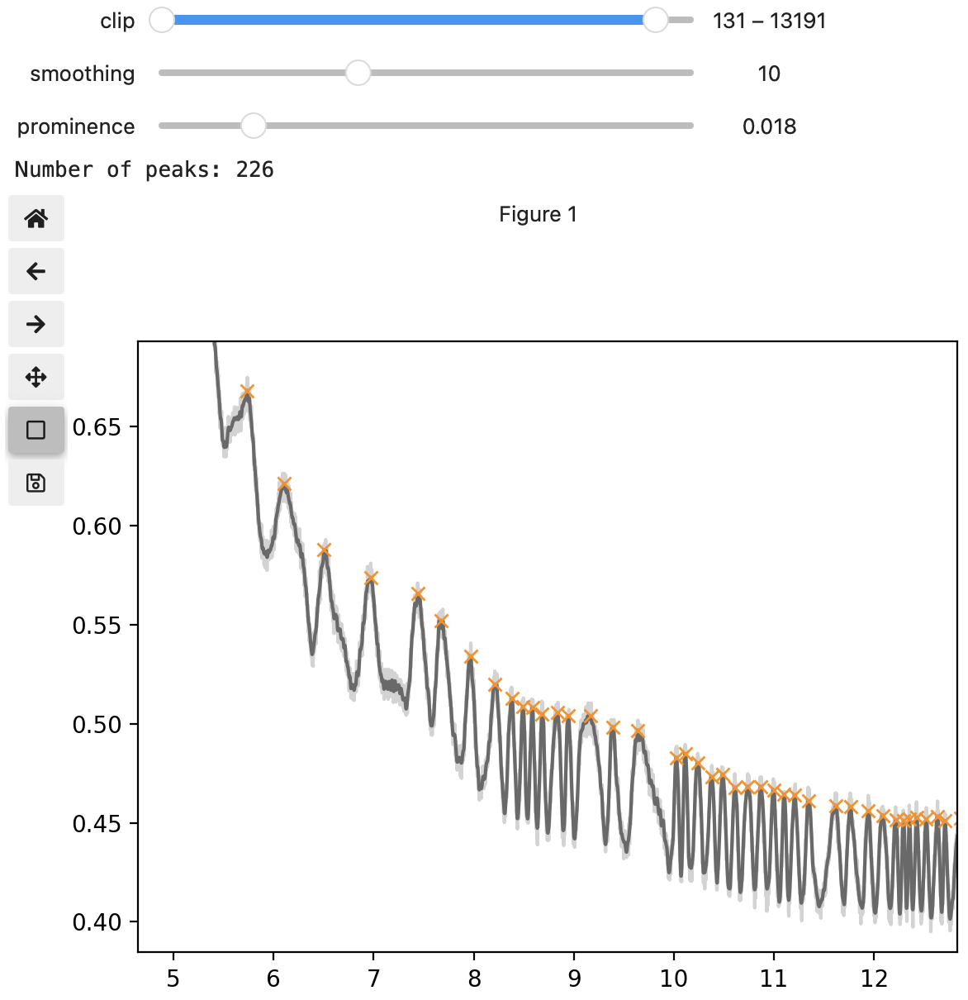

# Peak finder

You can use this notebook to find peaks in your data.

## Installation

To create a conda environment with Jupyter Lab and all dependencies, run:

```shell
$ conda env create -f environment.yml
```

Of course, you can also use this notebook in other environments as long as you have Jupyter, Jupyter Widgets, Pandas, SciPy and Matplotlib.

## Usage

Run Jupyter Lab with

```shell
$ jupyter lab
```

and load the notebook. At the bottom of the notebook you will find this line:

```python
find_peaks("mydatafile.csv")
```

Change `mydatafile.csv` to point at your data file and run the notebook. You should see something like this:



You can zoom into parts of your dataset and tweak the settings until you're satisfied with the detected peaks.
